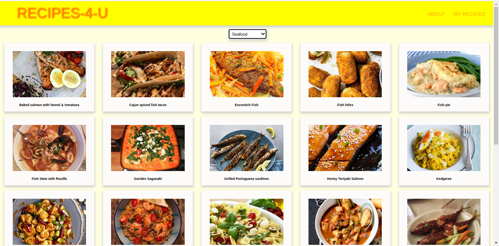
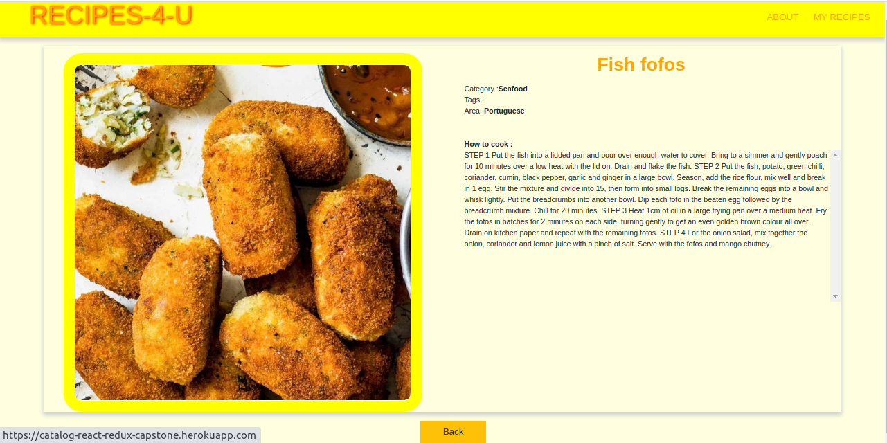

## React-Redux-Capstone
This the the capstone project at the end of the react-redux module of [Microverse](https://www.microverse.org/) main technical curriculum

The project is a single page application built with React and Redux
This projest has two pages:
- one page with a list of meals that could be filtered by categories
- and one page for the each meal with the meal`s details.
- All data was retrieved from the API, the catalogue of meals,   [Meals DB:](https://www.themealdb.com/api.php)

### Live Demo link
[Demo link](https://catalog-react-redux-capstone.herokuapp.com/)

##  Built with
 - ES6
 - React.js
 - Redux
 - HTML/CSS
 - Bootstrap
 - [API](https://www.themealdb.com/api.php)
 - Axios
 - npm
 - Heroku

### Prerequisites
- npm 7.0.0
- node 15.6.0

### Setup
Download or clone this repo:
https://github.com/Laguna1/catalog-react-redux-capstone

### Install
- cd root folder and run `npm install`
### Usage
- after install dependencies run `npm start`
### Tests
- run the tests in the project root folder using  `npm test`

## Author

👤 **Oksana Petrova**
 - Github:[@Laguna1](https://github.com/Laguna1)
 - Linkedin: [Oksana Petrova](https://www.linkedin.com/in/oksana-petrova/)
 - Twitter: [Oksana Petrova](https://twitter.com/OksanaP48303303)

### 🤝 Contributing

Contributions, issues and feature requests are welcome!

Feel free to check the [issues page](https://github.com/Laguna1/catalog-react-redux-capstone/issues)

### Show your support

Give a ⭐️ if you like this project! 

### 📝 License

This project is [MIT](https://opensource.org/licenses/MIT) licensed.